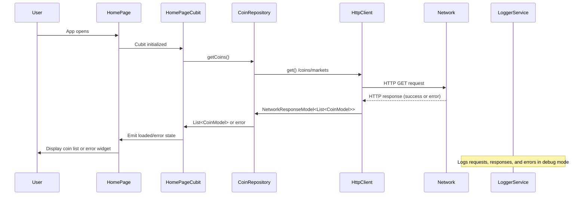

# CryptoWave

A Flutter application for tracking cryptocurrency prices, trends, and market data using the CoinGecko API.

## 📝 Project Overview

CryptoWave provides real-time cryptocurrency market data, price charts, and detailed information about various cryptocurrencies. The application uses the CoinGecko API to fetch up-to-date information.

## 🚀 Features

- Real-time cryptocurrency price tracking
- Detailed coin information and historical data
- Interactive price charts using FL Chart
- Clean and modern UI

## 🛠️ Tech Stack

- **Flutter**: UI framework for cross-platform application development
- **Bloc Pattern**: State management using flutter_bloc
- **CoinGecko API**: Data source for cryptocurrency information
- **Freezed**: Code generation for immutable models
- **GetIt**: Dependency injection

## 📋 Prerequisites

- Flutter SDK (^3.7.2)
- Dart SDK (^3.7.2)
- CoinGecko API Key (obtain from [CoinGecko Pro](https://www.coingecko.com/en/api/pricing))

## 🔧 Setup & Installation

### 1. Clone the repository

```bash
git clone https://github.com/Work90210/CryptoWave.git
cd CryptoWave
```

### 2. Install dependencies

```bash
flutter pub get
```

### 3. Create .env file

Run the following command to create a .env file:

```bash
touch .env
```

Then add your API key to the .env file:

```bash
echo "COINGECKO_API_KEY=your_coingecko_api_key_here" >> .env
```

Replace `your_coingecko_api_key_here` with your actual CoinGecko API key.

Alternatively, you can create the file manually with the following content:

```
COINGECKO_API_KEY=your_coingecko_api_key_here
```

### 4. Generate code files

```bash
flutter pub run build_runner build --delete-conflicting-outputs
```

### 5. Run the application

```bash
flutter run
```

## 📚 Project Structure

- `lib/constants.dart`: Application-wide constants including API URL
- `lib/models/`: Data models used throughout the application
- `lib/network/`: Network-related code (HTTP client, response handling, error handling)
- `lib/repositories/`: Repository classes for data fetching and business logic
- `lib/ui/`: User interface components and screens
- `lib/utils/`: Utility classes and helper functions

## 🔑 Constants

The application uses the following constants defined in `lib/constants.dart`:

```dart
class AppConstants {
  // API related constants
  static const String API_URL = 'https://api.coingecko.com/api/v3/';
}
```

## 📦 Dependencies

### Core Dependencies

- **flutter**: The UI framework
- **cupertino_icons**: iOS-style icons
- **fl_chart**: Beautiful and interactive charts
- **intl**: Internationalization and date formatting

### State Management

- **flutter_bloc**: Implementation of the BLoC pattern
- **equatable**: Simplified equality comparisons for classes

### Network & Data

- **http**: HTTP requests and API communication
- **freezed_annotation**: Annotations for the Freezed code generator
- **json_annotation**: Annotations for JSON serialization

### Configuration & Utilities

- **flutter_dotenv**: Environment variable management
- **get_it**: Dependency injection
- **logger**: Advanced logging
- **navigation_history_observer**: Navigation history tracking
- **lottie**: Lottie animation support

### Development Dependencies

- **flutter_test**: Testing library for Flutter
- **flutter_lints**: Lint rules for Flutter
- **very_good_analysis**: Strict static analysis rules
- **build_runner**: Code generation
- **freezed**: Code generation for immutable models
- **json_serializable**: JSON serialization code generation
- **bloc_test**: Testing utilities for BLoC pattern

## 📄 License

This project is licensed under the MIT License - see the LICENSE file for details.

## 🔄 Data Flow


