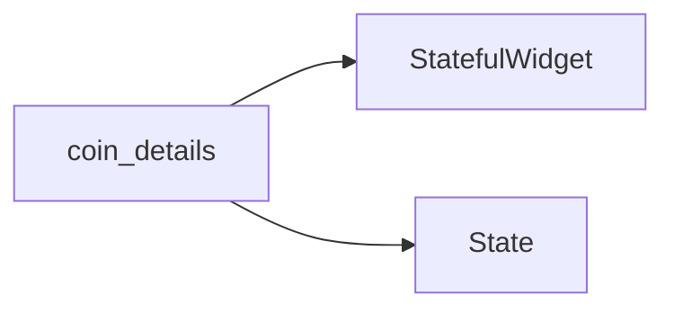

# CoinDetails Component

The `CoinDetails` component is responsible for displaying detailed information about a specific cryptocurrency.

## Purpose

This component is used to present comprehensive data for a selected cryptocurrency, including its price, market data, and historical performance.

## Props

TODO: The provided context does not detail the props or parameters for the `CoinDetails` component, including their types or default values.

## Usage Examples

TODO: The provided context does not include usage examples for the `CoinDetails` component.

## Accessibility Notes

Documentation must adhere to the Web Content Accessibility Guidelines (WCAG) 2.1 Level AA. This includes ensuring that information and user interface components are perceivable and operable. [S10]

## Styling and Theming

TODO: The provided context does not contain information regarding styling or theming for the `CoinDetails` component.

## Performance Considerations

TODO: The provided context does not include performance considerations for the `CoinDetails` component.

## Related Components and Files

*   **Repositories:** The application interacts with external data through repository classes. The `lib/repositories` directory contains specific repository classes for different data fetching needs. [S12] The `coin_repository.dart` file is identified as a key repository. [S6, S8, S11]
*   **API Interaction:** The CryptoWave application leverages the CoinGecko API for real-time cryptocurrency market data. [S1, S4, S7, S12, S13, S14] The `ExceptionHandler` class is responsible for processing and standardizing API exceptions. [S3, S13]

## Sources

*   [S1] docs/01-overview/system-overview.md
*   [S3] docs/04-apis/rest-api/status-codes.md
*   [S4] docs/02-architecture/system-architecture.md
*   [S6] docs/04-apis/rest-api/request-examples.md
*   [S7] docs/01-overview/README.md
*   [S8] docs/04-apis/versioning.md
*   [S10] docs/00-meta/doc-accessibility.md
*   [S11] docs/04-apis/rate-limiting.md
*   [S12] docs/04-apis/api-overview.md
*   [S13] docs/03-features/[feature-name]/platforms/api.md
*   [S14] docs/01-overview/system-boundaries.md

## Dependency Graph

## Related
- StatefulWidget
- State

## Related Files

| File |
|---|
| StatefulWidget.dart |
| State.dart |

## Sources
- lib/ui/coin_details/coin_details.dart

---
Generated by CodeSynapse · 2025-08-09