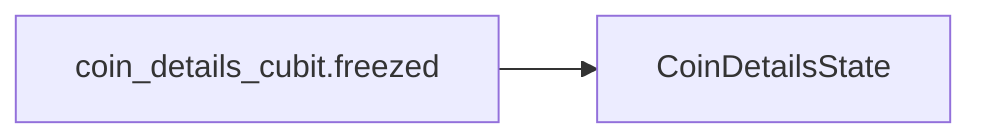

# CoinDetailsCubit

The `CoinDetailsCubit` is a Cubit responsible for managing the state related to the detailed view of a specific cryptocurrency. It is used to fetch and display comprehensive information about a cryptocurrency, including its market data and historical performance.

## Purpose and Usage

The `CoinDetailsCubit` is used to manage the state for screens that display detailed information about a single cryptocurrency. This includes fetching data such as current prices, market capitalization, trading volume, and historical price charts.

## Props/Parameters

The `CoinDetailsCubit` does not expose any direct props or parameters in its constructor. Its state is managed internally and updated based on data fetched from repositories.

## Usage Examples

```dart
// Example of initializing and using CoinDetailsCubit
import 'package:flutter_bloc/flutter_bloc.dart';
import 'package:cryptowave/ui/coin_details/cubit/coin_details_cubit.dart';

// Assuming you have a CoinRepository instance available
// final coinRepository = CoinRepository();

// In your widget tree:
// BlocProvider<CoinDetailsCubit>(
//   create: (context) => CoinDetailsCubit(coinRepository: coinRepository),
//   child: CoinDetailsScreen(),
// )

// Inside a widget that has access to the CoinDetailsCubit:
// final coinDetailsCubit = BlocProvider.of<CoinDetailsCubit>(context);
// coinDetailsCubit.fetchCoinDetails('bitcoin'); // Example: fetch details for Bitcoin
```

## Accessibility Notes (a11y)

Accessibility considerations for the UI components managed by `CoinDetailsCubit` should adhere to WCAG 2.1 Level AA guidelines, ensuring perceivability, operability, understandability, and robustness. Specific implementation details for accessibility will depend on the UI widgets used to display the data.

## Styling/Theming Guidance

Styling and theming of the UI elements managed by `CoinDetailsCubit` should follow the overall design system and theming conventions of the CryptoWave application.

## Performance Considerations

Performance considerations should focus on efficient data fetching and state management. The use of the Bloc pattern helps in managing state updates predictably. Ensure that data fetching is optimized to avoid unnecessary network requests and that the UI efficiently renders the received data.

## Related Components and Files

*   **`lib/ui/coin_details/cubit/coin_details_cubit.freezed.dart`**: This file contains the freezed definition for the `CoinDetailsCubit`'s state.
*   **`lib/repositories/coin_repository.dart`**: This repository is likely used by the `CoinDetailsCubit` to fetch cryptocurrency data.

## Sources

*   [S1] docs/01-overview/system-overview.md
*   [S2] docs/02-architecture/system-architecture.md
*   [S3] docs/01-overview/system-requirements.md
*   [S4] docs/01-overview/README.md
*   [S5] docs/03-features/feature-index.md
*   [S6] docs/04-apis/rest-api/status-codes.md
*   [S7] docs/00-meta/doc-accessibility.md
*   [S8] docs/04-apis/rest-api/endpoints/README.md
*   [S9] docs/01-overview/system-boundaries.md
*   [S10] docs/04-apis/rest-api/request-examples.md
*   [S11] docs/04-apis/versioning.md
*   [S12] docs/04-apis/rate-limiting.md
*   [S13] docs/04-apis/api-overview.md

## Dependency Graph




## Related
- CoinDetailsState

## Related Files

| File |
|---|
| CoinDetailsState.dart |

## Sources
- lib/ui/coin_details/cubit/coin_details_cubit.freezed.dart

---
Generated by CodeSynapse · 2025-08-09