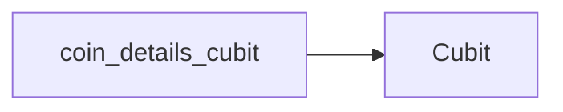

This documentation is for the `coin_details_cubit` component.

## Coin Details Cubit

The `coin_details_cubit` is a Cubit responsible for managing the state related to the detailed information displayed for a specific cryptocurrency. It is used to fetch and present comprehensive data about a cryptocurrency, including historical performance and market metrics.

### Usage

The `coin_details_cubit` is used to manage the state for displaying detailed cryptocurrency information.

### Props/Parameters

TODO: The props/parameters for `coin_details_cubit` are not detailed in the provided context.

### Usage Examples

TODO: Usage examples for `coin_details_cubit` are not provided in the context.

### Accessibility Notes

TODO: Accessibility notes for `coin_details_cubit` are not provided in the context.

### Styling/Theming Guidance

TODO: Styling and theming guidance for `coin_details_cubit` is not provided in the context.

### Performance Considerations

TODO: Performance considerations for `coin_details_cubit` are not provided in the context.

### Related Components and Files

*   **Repositories:** The `coin_details_cubit` interacts with repositories to fetch data. The `lib/repositories/coin_repository.dart` file is identified as a relevant repository. [S7, S10, S11, S12, S13]
*   **API:** The application leverages the CoinGecko API for fetching cryptocurrency data. [S1, S3, S5, S6, S7, S10, S11, S12, S13]

## Sources

*   [S1] docs/01-overview/system-overview.md
*   [S3] docs/02-architecture/system-architecture.md
*   [S5] docs/01-overview/README.md
*   [S6] docs/04-apis/rest-api/status-codes.md
*   [S7] docs/04-apis/rest-api/endpoints/README.md
*   [S10] docs/04-apis/rest-api/request-examples.md
*   [S11] docs/04-apis/versioning.md
*   [S12] docs/04-apis/rate-limiting.md
*   [S13] docs/04-apis/api-overview.md

## Dependency Graph

## Related
- Cubit

## Related Files

| File |
|---|
| Cubit.dart |

## Sources
- lib/ui/coin_details/cubit/coin_details_cubit.dart

---
Generated by CodeSynapse · 2025-08-09