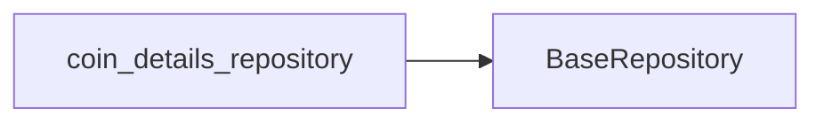

# Coin Details Repository

The `coin_details_repository` is responsible for fetching detailed information about individual cryptocurrencies. It interacts with external APIs to retrieve this data.

## Purpose

This repository is used to obtain comprehensive data for a specific cryptocurrency, which may include historical performance, market metrics, and other relevant details.

## Usage

The `coin_details_repository` is utilized within the CryptoWave application to power features that display in-depth information about cryptocurrencies.

## Props/Parameters

TODO: The specific props or parameters for `coin_details_repository` are not detailed in the provided context.

## Usage Examples

TODO: Concrete usage examples for `coin_details_repository` are not available in the provided context.

## Accessibility Notes

TODO: Accessibility considerations for `coin_details_repository` are not detailed in the provided context.

## Styling/Theming Guidance

TODO: Styling and theming guidance related to `coin_details_repository` is not available in the provided context.

## Performance Considerations

TODO: Performance considerations for `coin_details_repository` are not detailed in the provided context.

## Related Components and Files

*   **API Interaction:** The `coin_details_repository` interacts with external APIs, primarily the CoinGecko API, to fetch data.
*   **Error Handling:** The `ExceptionHandler` class is involved in processing and standardizing API exceptions.

## Sources

*   lib/repositories/coin_repository.dart

## Dependency Graph

## Related
- BaseRepository

## Related Files

| File |
|---|
| BaseRepository.dart |

## Sources
- lib/repositories/coin_details_repository.dart

---
Generated by CodeSynapse · 2025-08-09