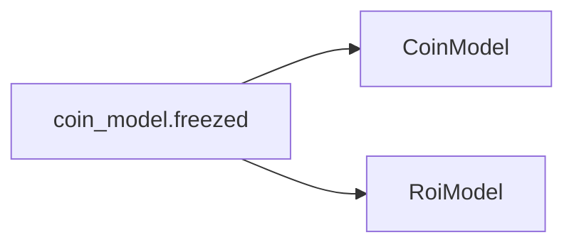

# `coin_model.freezed.dart`

## Purpose and Usage

The `coin_model.freezed.dart` file defines the `CoinModel` class, which represents a cryptocurrency's data within the CryptoWave application. This model is used to structure and manage information fetched from the CoinGecko API, including details like price, market data, and historical performance.

Use `CoinModel` whenever you need to represent or process cryptocurrency data, such as displaying coin details in a list, showing historical charts, or managing portfolio information.

## Props/Parameters

The `CoinModel` class is a Freezed union, meaning it defines a set of immutable properties. The specific properties available are not detailed in the provided context.

TODO: Detail the properties of the `CoinModel` class.

## Usage Examples

```dart
// Example of creating a CoinModel instance (assuming properties are known)
// This is a hypothetical example as the exact constructor is not provided.
/*
final coin = CoinModel(
  id: 'bitcoin',
  symbol: 'btc',
  name: 'Bitcoin',
  // ... other properties
);
*/
```

## Accessibility Notes (a11y)

Documentation for the CryptoWave application must adhere to WCAG 2.1 Level AA standards [S9]. While `CoinModel` itself is a data model and does not directly render UI elements, any UI components that display data from `CoinModel` should be built with accessibility in mind, ensuring perceivability, operability, and understandability.

## Styling/Theming Guidance

Styling and theming guidance for components utilizing `CoinModel` is not provided in the current context.

## Performance Considerations

The CryptoWave application leverages the CoinGecko API for real-time data fetching [S2, S5, S6, S7, S10, S11]. Efficiently handling and processing the data represented by `CoinModel` is crucial for maintaining real-time performance. The use of Freezed for immutable data models can contribute to predictable state management and potentially improve performance by simplifying change detection.

## Related Components and Files

*   **`lib/repositories/coin_repository.dart`**: This file likely contains the logic for fetching cryptocurrency data, which would then be mapped to `CoinModel` instances [S10, S11].
*   **CoinGecko API**: The data for `CoinModel` is sourced from the CoinGecko API [S2, S5, S6, S7, S10, S11].

## Sources

*   [S2] docs/01-overview/system-overview.md
*   [S5] docs/01-overview/README.md
*   [S6] docs/04-apis/rest-api/status-codes.md
*   [S7] docs/04-apis/rest-api/endpoints/README.md
*   [S9] docs/00-meta/doc-accessibility.md
*   [S10] docs/04-apis/rest-api/request-examples.md
*   [S11] docs/04-apis/versioning.md

## Dependency Graph




## Related
- CoinModel
- RoiModel

## Related Files

| File |
|---|
| CoinModel.dart |
| RoiModel.dart |

## Sources
- lib/models/coin/coin_model.freezed.dart

---
Generated by CodeSynapse · 2025-08-09