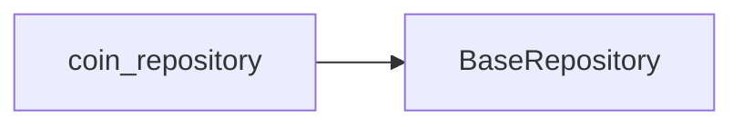

# `coin_repository`

The `coin_repository` is responsible for managing data interactions related to cryptocurrencies. It abstracts API calls to fetch real-time cryptocurrency market data, including prices, trends, and detailed coin information from the CoinGecko API.

## Purpose

Use `coin_repository` to fetch and manage cryptocurrency data within the CryptoWave application. It serves as the primary interface for accessing external market data.

## Props/Parameters

TODO: The provided context does not detail specific props or parameters for `coin_repository`.

## Usage Examples

```dart
// Example of fetching coin data (specific method not detailed in context)
// Assuming a method like `fetchCoinData` exists within coin_repository

// Initialize the repository
final coinRepository = CoinRepository();

// Fetch data for a specific coin (e.g., Bitcoin)
try {
  final coinData = await coinRepository.fetchCoinData('bitcoin');
  // Process coinData
} catch (e) {
  // Handle errors
}
```

## Accessibility Notes

TODO: The provided context does not contain specific accessibility notes for `coin_repository`.

## Styling/Theming Guidance

TODO: The provided context does not contain styling or theming guidance for `coin_repository`.

## Performance Considerations

The performance of `coin_repository` is directly tied to the CoinGecko API's response times and the efficiency of data processing within the repository. Network stability and the volume of data fetched can impact overall application performance.

## Related Components and Files

*   **`lib/repositories/coin_repository.dart`**: Contains the implementation of the `coin_repository`.
*   **CoinGecko API**: The external API that `coin_repository` interacts with to fetch data.
*   **`ExceptionHandler`**: A class responsible for processing and standardizing API exceptions. (Referenced in `docs/04-apis/rest-api/status-codes.md` and `docs/03-features/[feature-name]/platforms/api.md`)

## Sources

*   [S8] docs/04-apis/rest-api/endpoints/README.md
*   [S9] docs/04-apis/rest-api/request-examples.md
*   [S11] docs/04-apis/versioning.md
*   [S12] docs/04-apis/rate-limiting.md
*   [S13] docs/04-apis/api-overview.md
*   [S14] docs/03-features/[feature-name]/platforms/api.md

## Dependency Graph




## Related
- BaseRepository

## Related Files

| File |
|---|
| BaseRepository.dart |

## Sources
- lib/repositories/coin_repository.dart

---
Generated by CodeSynapse · 2025-08-09