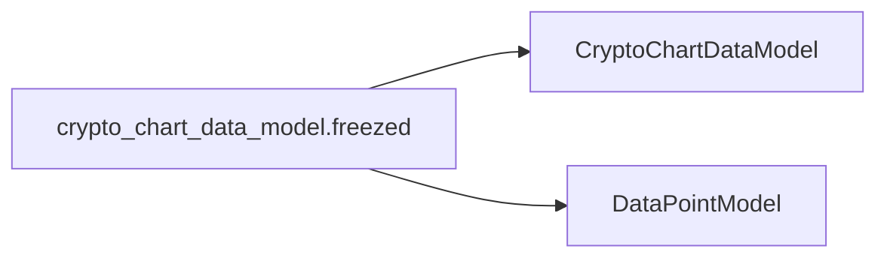

# `crypto_chart_data_model.freezed.dart`

This file defines the `CryptoChartDataModel` using Freezed for immutable data modeling, intended for representing cryptocurrency chart data.

## Purpose and Usage

The `CryptoChartDataModel` is used to structure and manage data points for cryptocurrency price charts. It is utilized within the CryptoWave application to hold information such as the date, price, and potentially other market metrics for a specific cryptocurrency at a given point in time.

## Props/Parameters

The `CryptoChartDataModel` is defined with the following properties:

*   `date`: A `DateTime` object representing the timestamp of the data point.
*   `price`: A `double` representing the price of the cryptocurrency at the given date.

## Usage Examples

```dart
import 'package:crypto_wave/models/coin_details/crypto_chart_data_model/crypto_chart_data_model.dart';

// Example of creating a CryptoChartDataModel instance
final chartDataPoint = CryptoChartDataModel(
  date: DateTime.now(),
  price: 1500.50,
);

// Accessing properties
print('Date: ${chartDataPoint.date}');
print('Price: ${chartDataPoint.price}');
```

## Accessibility Notes

Accessibility considerations for this model are primarily related to how the data it represents is displayed in the UI. Ensure that any UI elements using this data adhere to accessibility best practices, such as providing appropriate labels and semantic information.

## Styling/Theming Guidance

This model itself does not dictate styling. Styling should be applied to the UI components that consume and display the data contained within `CryptoChartDataModel` instances.

## Performance Considerations

As an immutable data model, `CryptoChartDataModel` contributes to predictable state management, which can positively impact performance by simplifying change detection. Ensure efficient data fetching and processing when populating lists or charts with these models.

## Related Components and Files

*   `lib/models/coin_details/crypto_chart_data_model/crypto_chart_data_model.dart`: The primary definition file for the `CryptoChartDataModel`.

## Sources

*   lib/models/coin_details/crypto_chart_data_model/crypto_chart_data_model.freezed.dart

## Dependency Graph




## Related
- CryptoChartDataModel
- DataPointModel

## Related Files

| File |
|---|
| CryptoChartDataModel.dart |
| DataPointModel.dart |

## Sources
- lib/models/coin_details/crypto_chart_data_model/crypto_chart_data_model.freezed.dart

---
Generated by CodeSynapse · 2025-08-09