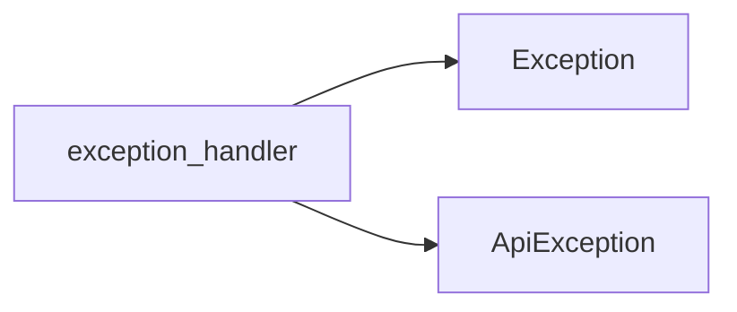

# Exception Handler

The `ExceptionHandler` class is responsible for processing and standardizing API responses, particularly in handling errors.

## Purpose and Usage

The `ExceptionHandler` is used to manage and present API-related errors to the user in a consistent manner. It abstracts the complexities of raw API error responses, providing a more user-friendly and predictable error handling mechanism within the application.

## Props/Parameters

TODO: The provided context does not detail the specific props or parameters of the `ExceptionHandler` class.

## Usage Examples

TODO: The provided context does not include usage examples for the `ExceptionHandler` class.

## Accessibility Notes

TODO: The provided context does not contain information regarding the accessibility considerations for the `ExceptionHandler` class.

## Styling/Theming Guidance

TODO: The provided context does not offer guidance on styling or theming for the `ExceptionHandler` class.

## Performance Considerations

TODO: The provided context does not specify any performance considerations related to the `ExceptionHandler` class.

## Related Components and Files

*   **File:** `lib/network/exception_handler.dart`
*   **API Interaction:** The `ExceptionHandler` class is involved in processing API responses, as indicated by its role in standardizing API error handling. [S8]

## Sources

*   [S8] docs/04-apis/rest-api/status-codes.md

## Dependency Graph

## Related
- Exception
- ApiException

## Related Files

| File |
|---|
| Exception.dart |
| ApiException.dart |

## Sources
- lib/network/exception_handler.dart

---
Generated by CodeSynapse · 2025-08-09