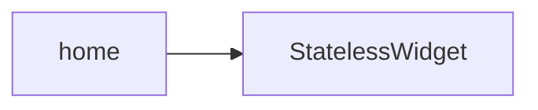

```dart
// TODO: Add documentation for the HomePage widget.
```

## Dependency Graph




## Related
- StatelessWidget

## Related Files

| File |
|---|
| StatelessWidget.dart |

## Sources
- lib/ui/home_page/home.dart

---
Generated by CodeSynapse · 2025-08-09