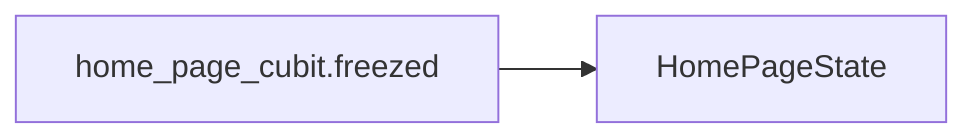

This documentation is for the `home_page_cubit.freezed` file, which is part of the CryptoWave application.

## Purpose and Usage

The `home_page_cubit.freezed` file likely defines the state and events for a Cubit managing the UI state of the home page. Freezed is a code generation library used to create immutable classes and sealed unions, which are beneficial for state management in Flutter applications. This Cubit would be used to manage the data and UI state displayed on the main screen of the CryptoWave application, such as cryptocurrency prices, market data, and potentially user-specific information.

## Props/Parameters and Defaults

Information regarding specific props or default parameters for `home_page_cubit.freezed` is not available in the provided context.

## Usage Examples

A usage example for `home_page_cubit.freezed` cannot be provided as the specific implementation details and how it integrates with the UI are not present in the provided context.

## Accessibility Notes (a11y)

Accessibility guidelines for documentation are outlined in `docs/00-meta/doc-accessibility.md`, which states that documentation must adhere to WCAG 2.1 Level AA. Specific accessibility considerations for `home_page_cubit.freezed` are not detailed in the provided context.

## Styling/Theming Guidance

Styling and theming guidance for `home_page_cubit.freezed` is not available in the provided context.

## Performance Considerations

Performance considerations for `home_page_cubit.freezed` are not available in the provided context.

## Related Components and Files

*   **`lib/ui/home_page/cubit/home_page_cubit.freezed.dart`**: This file itself, defining the state and events.
*   **`lib/ui/home_page/cubit/home_page_cubit.dart`**: The corresponding Cubit class that would use the states and events defined in the `.freezed.dart` file.
*   **`lib/ui/home_page/home_page.dart`**: The Flutter widget for the home page, which would likely consume the `HomePageCubit`.

## Sources

*   docs/00-meta/doc-accessibility.md

## Dependency Graph

## Related
- HomePageState

## Related Files

| File |
|---|
| HomePageState.dart |

## Sources
- lib/ui/home_page/cubit/home_page_cubit.freezed.dart

---
Generated by CodeSynapse · 2025-08-09