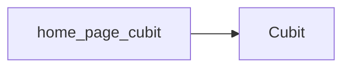

# HomePageCubit

The `HomePageCubit` manages the state and business logic for the home page of the CryptoWave application. It is responsible for fetching and processing cryptocurrency market data to be displayed to the user.

## Purpose and Usage

The `HomePageCubit` is used to:
*   Fetch real-time cryptocurrency prices.
*   Retrieve market capitalization, trading volume, and 24-hour price ranges.
*   Load historical data for price charts.
*   Provide detailed information about individual cryptocurrencies.

It is utilized within the home page UI to manage the state related to these data fetching operations.

## Props/Parameters

TODO: The provided context does not detail the props or parameters of the `HomePageCubit`.

## Usage Examples

TODO: The provided context does not contain usage examples for the `HomePageCubit`.

## Accessibility Notes (a11y)

TODO: The provided context does not contain specific accessibility notes for the `HomePageCubit`. However, general documentation accessibility guidelines require adherence to WCAG 2.1 Level AA standards, ensuring information is perceivable, operable, and understandable [S9].

## Styling/Theming Guidance

TODO: The provided context does not contain styling or theming guidance specific to the `HomePageCubit`.

## Performance Considerations

TODO: The provided context does not contain performance considerations specific to the `HomePageCubit`.

## Related Components and Files

*   **`lib/repositories/coin_repository.dart`**: This file is identified as containing repository classes that abstract API calls, including those likely used by `HomePageCubit` to fetch data from the CoinGecko API [S7, S10, S11, S12, S13].
*   **CoinGecko API**: The `HomePageCubit` interacts with the CoinGecko API to retrieve cryptocurrency data [S1, S3, S5, S6, S10, S11, S12, S13].

## Sources

*   [S1] docs/01-overview/system-overview.md
*   [S3] docs/02-architecture/system-architecture.md
*   [S5] docs/01-overview/README.md
*   [S6] docs/04-apis/rest-api/status-codes.md
*   [S7] docs/04-apis/rest-api/endpoints/README.md
*   [S9] docs/00-meta/doc-accessibility.md
*   [S10] docs/04-apis/rest-api/request-examples.md
*   [S11] docs/04-apis/versioning.md
*   [S12] docs/04-apis/rate-limiting.md
*   [S13] docs/04-apis/api-overview.md

## Dependency Graph

## Related
- Cubit

## Related Files

| File |
|---|
| Cubit.dart |

## Sources
- lib/ui/home_page/cubit/home_page_cubit.dart

---
Generated by CodeSynapse · 2025-08-09