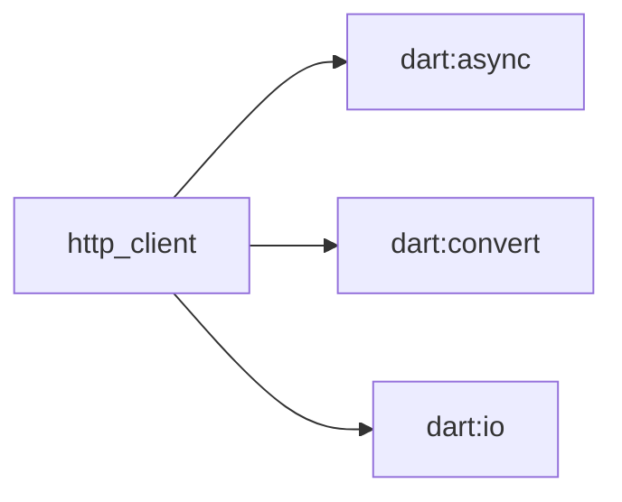

# HTTP Client

The `http_client` is a fundamental component within the CryptoWave application responsible for making network requests. It facilitates the retrieval of real-time cryptocurrency market data from external APIs, primarily the CoinGecko API.

## Purpose and Usage

The `http_client` is used whenever the application needs to communicate with external services to fetch data. This includes:

*   Retrieving current cryptocurrency prices.
*   Accessing market capitalization, trading volume, and 24-hour price ranges.
*   Fetching historical data for price charts.
*   Obtaining detailed information about individual cryptocurrencies.

## Props/Parameters

TODO: The provided context does not detail the specific props or parameters of the `http_client` class, nor does it specify any default values.

## Usage Examples

TODO: The provided context does not contain any usage examples for the `http_client`.

## Accessibility Notes

TODO: The provided context does not contain any accessibility notes related to the `http_client`.

## Styling/Theming Guidance

TODO: The provided context does not contain any styling or theming guidance for the `http_client`.

## Performance Considerations

TODO: The provided context does not contain any performance considerations for the `http_client`.

## Related Components and Files

*   **`lib/repositories/coin_repository.dart`**: This file is identified as abstracting API calls, suggesting it utilizes the `http_client` for data fetching. [S9, S10, S12]
*   **CoinGecko API**: The `http_client` interacts with the CoinGecko API to obtain cryptocurrency data. [S1, S3, S6, S8, S9, S10, S11, S12]

## Sources

*   lib/network/http_client.dart

## Dependency Graph

## Related
- dart:async
- dart:convert
- dart:io

## Related Files

| File |
|---|
| dart:async |
| dart:convert |
| dart:io |

## Sources
- lib/network/http_client.dart

---
Generated by CodeSynapse · 2025-08-09