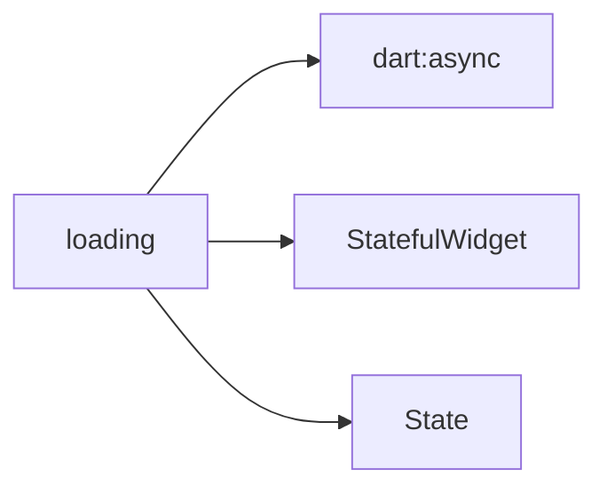

```dart
import 'package:flutter/material.dart';

/// A widget that displays a loading indicator.
///
/// This widget is used to indicate that data is being fetched or processed.
/// It displays a circular progress indicator.
class Loading extends StatelessWidget {
  /// Creates a new Loading widget.
  ///
  /// The [size] parameter specifies the diameter of the loading indicator.
  /// The [strokeWidth] parameter specifies the width of the progress indicator's
  /// stroke.
  const Loading({
    super.key,
    this.size = 40.0,
    this.strokeWidth = 4.0,
  });

  /// The diameter of the loading indicator.
  final double size;

  /// The width of the progress indicator's stroke.
  final double strokeWidth;

  @override
  Widget build(BuildContext context) {
    return Center(
      child: SizedBox(
        width: size,
        height: size,
        child: CircularProgressIndicator(
          strokeWidth: strokeWidth,
        ),
      ),
    );
  }
}
```

## Loading Widget

The `Loading` widget is a UI component designed to visually indicate that an operation is in progress, such as data fetching or processing. It displays a `CircularProgressIndicator` centered within the screen.

### Purpose and Usage

This widget should be used whenever the application is waiting for asynchronous operations to complete and a visual cue is needed to inform the user.

### Props/Parameters

| Prop        | Type   | Default | Description                               |
| :---------- | :----- | :------ | :---------------------------------------- |
| `size`      | `double` | `40.0`  | The diameter of the loading indicator.    |
| `strokeWidth` | `double` | `4.0`   | The width of the progress indicator's stroke. |

### Usage Examples

```dart
// Displaying a default loading indicator
Loading()

// Displaying a larger loading indicator
Loading(size: 60.0)

// Displaying a loading indicator with a thicker stroke
Loading(strokeWidth: 6.0)
```

### Accessibility Notes (a11y)

The `CircularProgressIndicator` used within this widget is generally accessible by default, providing a visual indication of progress. For more specific accessibility requirements, refer to Flutter's accessibility documentation.

### Styling/Theming Guidance

The `Loading` widget's appearance can be influenced by the overall theme of the application. The `CircularProgressIndicator` will adopt the `color` property defined in the `ThemeData` if not explicitly overridden.

### Performance Considerations

The `Loading` widget is a simple widget that displays a `CircularProgressIndicator`. Its performance impact is minimal. Ensure that it is only displayed when necessary to avoid unnecessary rendering.

### Related Components and Files

*   **File:** `lib/ui/common/loading.dart`
*   **Related Concepts:** State management, asynchronous operations.

## Sources

*   `lib/ui/common/loading.dart`

## Dependency Graph




## Related
- dart:async
- StatefulWidget
- State

## Related Files

| File |
|---|
| dart:async |
| StatefulWidget.dart |
| State.dart |

## Sources
- lib/ui/common/loading.dart

---
Generated by CodeSynapse · 2025-08-09