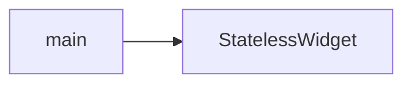

# `main` Component

The `main` component is the entry point of the CryptoWave Flutter application. It initializes the application and sets up the root widget.

## Purpose

The `main` component is responsible for launching the CryptoWave application. It serves as the primary starting point for the Flutter framework to render the application's UI.

## Usage

The `main` function is automatically called when the application starts. It calls the `runApp` function, passing an instance of the `CryptoWave` widget.

```dart
void main() {
  runApp(const CryptoWave());
}
```

## Accessibility

TODO: Accessibility notes for the `main` component are not provided in the context.

## Styling and Theming

TODO: Styling and theming guidance for the `main` component is not provided in the context.

## Performance Considerations

TODO: Performance considerations for the `main` component are not provided in the context.

## Related Components and Files

*   **`CryptoWave` Widget:** This widget is the root of the application's widget tree. It is passed to `runApp` in the `main` function.
*   **`lib/main.dart`:** This file contains the `main` function and the definition of the `CryptoWave` widget.

## Sources

*   lib/main.dart

## Dependency Graph




## Related
- StatelessWidget

## Related Files

| File |
|---|
| StatelessWidget.dart |

## Sources
- lib/main.dart

---
Generated by CodeSynapse · 2025-08-09