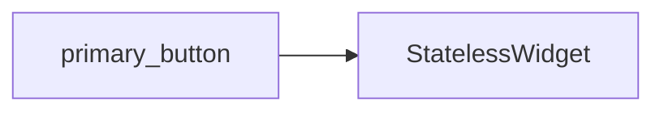

```dart
// TODO: Provide documentation for the primary_button component.
// The provided context does not contain information about the `primary_button`
// component, its purpose, props, usage, accessibility, styling, performance,
// or related components.
```

## Sources

*   lib/ui/common/primary_button.dart

## Dependency Graph




## Related
- StatelessWidget

## Related Files

| File |
|---|
| StatelessWidget.dart |

## Sources
- lib/ui/common/primary_button.dart

---
Generated by CodeSynapse · 2025-08-09